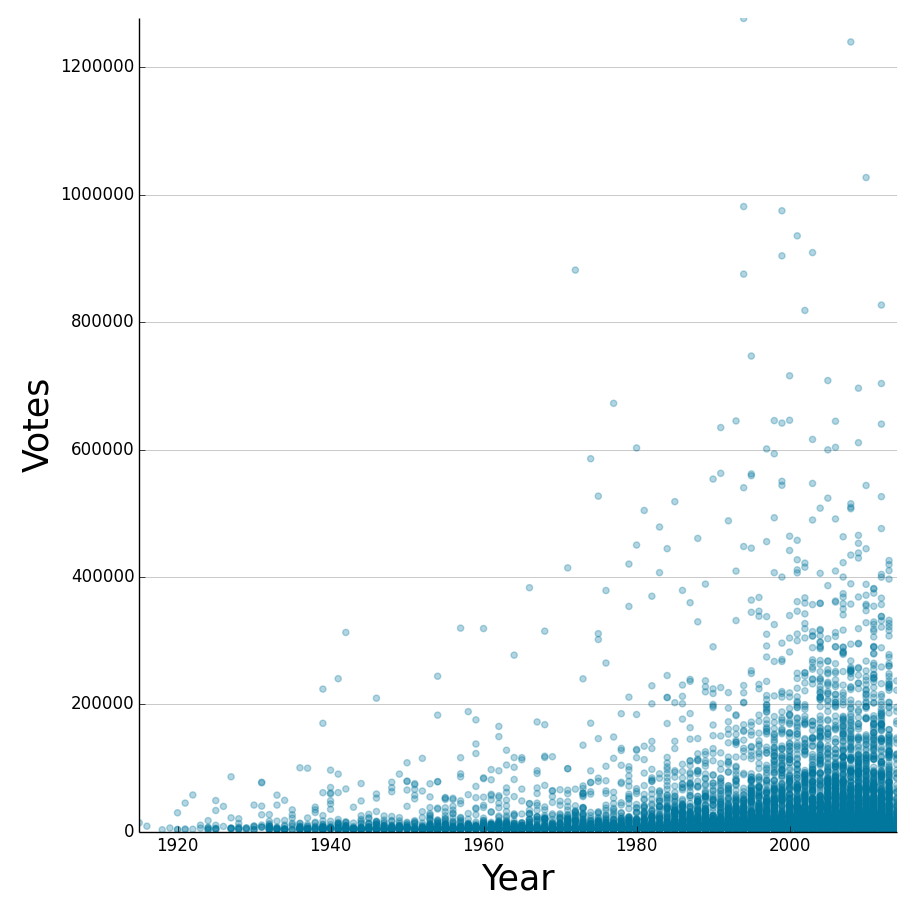

IMDB-Scraper
============

A simple project that I made in order to get accustomed to beautiful soup, matplotlib and pandas. 

What I did was scraped the first 10000 movie titles that were sorted in descending order of their vote count.

I got bored with the data quite fast but here are a few interesting finds:

Arround 1940 there are a few movies that stand out from the crowd with respects to number of votes.
They are also high scored, but that is quite common in old movies. Nobody watches bad old movies anymore. 
There are enough of bad new movies.

                     name   year  score  duration    votes  
               Casablanca   1942    8.6       102   313040  
             Citizen Kane   1941    8.4       119   240466  
         The Wizard of Oz   1939    8.1       102   224122  
    It's a Wonderful Life   1946    8.7       130   209862  
       Gone with the Wind   1939    8.2       238   170443  
             Modern Times   1936    8.6        87   100658

There was only one Adult-tagged movie. It turns out it was Caligula from 1979.

Also, please remember to be nice while you scrape websites.

The end result looks like this (viewing it in fullsize would be more helpfull):

